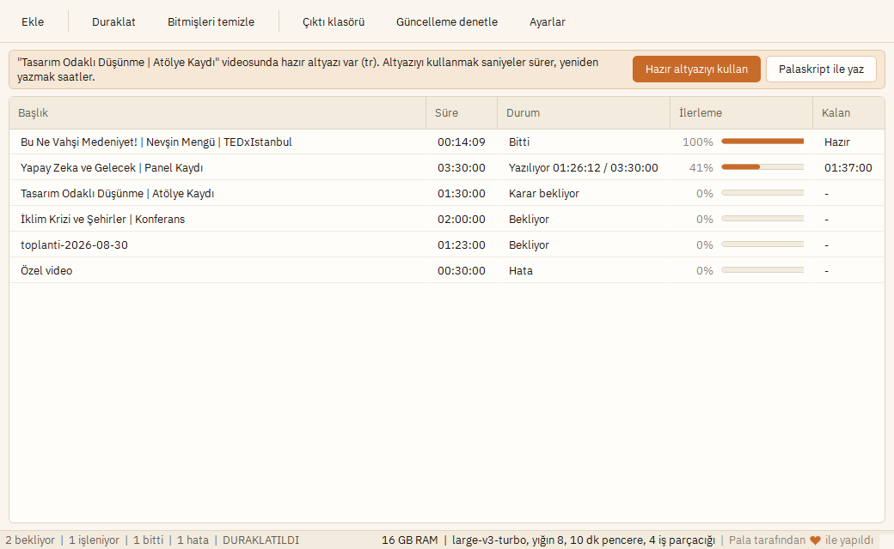

# Palaskript

YouTube linkinden veya yerel videodan **PDF transkript** ureten Windows masaustu
uygulamasi. Transkripsiyon tamamen **yerelde** calisiyor: ses hicbir zaman
ucuncu bir servise gonderilmiyor.

Link yapistir, kuyruga at, PDF al.



---

## Ne yapiyor

- **YouTube linki veya yerel dosya.** Playlist adresleri tek tek videolara aciliyor.
  Linkler cok satirli kutuya satir satir yapistiriliyor, dosyalar surukleyip birakiliyor.
- **Kalici kuyruk.** Uygulama kapansa da duruyor. Yarim kalan isler acilista
  kaldigi yerden devam ediyor, bastan baslamiyor.
- **Bolumlu PDF.** Video YouTube bolum isaretleri tasiyorsa PDF'te baslik,
  icindekiler ve yer imi oluyor; 3.5 saatlik bir konusma 90 sayfalik duz metin
  duvari yerine gezilebilir bir belge cikiyor. Video bolum tasimiyorsa belirli
  araliklarla zaman basligi konuyor.
- **Hazir altyazi kisayolu.** Videoda insan eliyle yazilmis altyazi varsa
  sorup onu kullanabiliyor: 3 saatlik islem 2 saniyeye iniyor.
- **8 GB RAM'de calisiyor.** Model, yigin boyutu ve pencere boyu acilista
  olculen bellege gore seciliyor; is sirasinda bellek daralirsa cokmek yerine
  yavasliyor.
- Cikti: PDF + TXT.

---

## Kurulum (kullanici)

`dist/Palaskript-Setup-1.0.0.exe` dosyasini calistirin (96 MB, kuruldugunda
diskte ~350 MB). Yonetici hakki istemiyor, kullanici klasorune kuruluyor.

### Windows uyarilari

Dosya imzasiz oldugu icin **iki ayri uyari** cikiyor. Ikisi de dosyada bir
sorun oldugunu soylemiyor; **itibar** uyarisi bunlar.

**1. Indirirken** (Chrome/Edge):

> Palaskript-Setup-1.0.0.exe yaygin olarak indirilen bir dosya degil.

Tarayicinin Indirilenler listesinde dosyanin yanindaki **uc noktaya** tiklayin,
**Sakla** > **Yine de sakla** deyin.

**2. Calistirirken** (SmartScreen):

> Windows bilgisayarinizi korudu

**Ek bilgi** > **Yine de calistir**.

#### Neden cikiyor

Microsoft SmartScreen, imzalanmamis bir programi **kac kez indirildigine** gore
degerlendiriyor. Yeni yayinlanmis bir dosyanin indirme sayisi sifir oldugu icin
"bunu tanimiyorum" diyor. Virus taramasi degil, itibar sorgusu.

Kod imzalama sertifikasi alinirsa bu uyari kalkar (bkz. asagidaki not).

#### Dosyanin dogru indigini kontrol etmek

Her yayinda kurulum dosyasinin yaninda bir `.sha256` dosyasi var. PowerShell'de:

```powershell
Get-FileHash .\Palaskript-Setup-1.0.0.exe -Algorithm SHA256
```

Cikan deger `.sha256` dosyasindakiyle ayni olmali.

Ilk baslatmada dil modeli iniyor (varsayilan `large-v3-turbo`, ~1.6 GB).
Model `%LOCALAPPDATA%\Palaskript\models` altinda kaliyor, bir kez iniyor.
Modeller kurulum dosyasina BILEREK dahil edilmedi: `large-v3` tek basina 3 GB.

---

## Donanim ve sure beklentisi

GPU kullanilmiyor, her sey CPU'da calisiyor. 3.5 saatlik bir video icin kaba beklenti:

| Model | Indirme | RAM (yigin 4) | 3.5 saat | Turkce kalitesi | 8 GB'da |
|---|---|---|---|---|---|
| `small` | ~250 MB | ~1.0 GB | ~40-60 dk | Zayif | Rahat |
| `medium` | ~1.5 GB | ~2.0 GB | ~2-3 saat | Orta | Rahat |
| `large-v3-turbo` | ~1.6 GB | ~2.2 GB | ~2.5-3.5 saat | Iyi | **Varsayilan** |
| `large-v3` | ~3.1 GB | ~4.0 GB | ~6-8 saat | En iyi | Hayir, 16 GB ister |

`large-v3-turbo`, `large-v3` ile ayni encoder'i kullaniyor (asil bellek orada),
sadece decoder'i kucuk. Bu yuzden RAM'i yari yariya dusuk ama kalitesi ona yakin.

**Olculen deger:** bu makinede (i7-1165G7, 4 cekirdek, GPU yok) `large-v3-turbo`
14 dakikalik bir Turkce TEDx konusmasini 11.3 dakikada yazdi, yani **~1.25x gercek
zaman**. Ayni oranla 3.5 saatlik video ~2.8 saat eder.

> Tablodaki RAM rakamlari hala **tahmin**. Kendi makinenizde olcmek icin
> `scripts/benchmark.py` kullanin; gercek tepe RSS degerleri
> `palaskript/resources.py` icindeki katalogla karsilastirilir.

Uygulama, kuyruk calisirken bilgisayarin uyumasini engelliyor ve isci sureci
dusuk oncelikte calistiriyor: gece boyu suren bir is sirasinda bilgisayar
kullanilabilir kaliyor.

### Kendini olcuyor

Kurulum sirasinda olcum yapilmiyor: olcum icin modelin inmis olmasi gerekir
(1.6 GB) ve kurulumu on dakikaya cikarmak kotu bir takas olurdu.

Bunun yerine olcum ZATEN YAPILAN ISTEN aliniyor. Ilk isiniz bittiginde bu
makinenin gercek tepe bellegi ve hizi kaydediliyor
(`%APPDATA%\Palaskript\calibration.json`), sonraki isler tahmin yerine bu
degerle boyutlaniyor. Model beklenenden agir ciktiysa yigin boyutu
kendiliginden kuculuyor. Hicbir ek bekleme yok.

Ilk acilista bir kez donanim ozeti gosteriliyor: ne tespit edildigi, hangi
modelin secildigi ve ne kadar indirilecegi. Buradan model degistirilebiliyor ve
model istege bagli olarak o anda indirilebiliyor.

---

## Gelistirme

```bash
git clone <repo> palaskript
cd palaskript
py -3.12 -m venv .venv
.venv\Scripts\pip install -e ".[dev]"
```

Kalite kapisi:

```bash
.venv\Scripts\ruff check palaskript tests scripts
.venv\Scripts\pytest tests -q
```

Arayuzu calistir:

```bash
.venv\Scripts\python run_palaskript.py
```

Komut satirindan tek is (arayuz olmadan uctan uca hat):

```bash
.venv\Scripts\python -m palaskript.cli "https://www.youtube.com/watch?v=..." --lang tr
.venv\Scripts\python -m palaskript.cli --info
```

Donanim olcumu (model secimini buradan yapin):

```bash
.venv\Scripts\python scripts\benchmark.py "https://www.youtube.com/watch?v=..." --slice-minutes 8
```

Kurulum dosyasini uret:

```bash
.venv\Scripts\python scripts\build.py
```

Uretilen ciktilar:

| Cikti | Boyut |
|---|---|
| `dist/Palaskript/` (calisir paket) | ~350 MB |
| `dist/Palaskript-Setup-1.0.0.exe` | ~96 MB |

PyInstaller adimi bu makinede ~4.5 dakika suruyor.

Inno Setup kurulu degilse sadece `dist/Palaskript/` klasoru uretilir, uygulama
yine calisir. Kurmak icin: `winget install JRSoftware.InnoSetup`

---

## Gorunum

Uygulama sistem temasini TAKIP ETMIYOR, kendi paletini ve yazi tipini
kullaniyor. Iki gerekce:

- **Tutarlilik.** Windows'un acik ve koyu temasi ayni arayuzu iki farkli sekilde
  gosteriyor; ozel renkler (uyari cubuklari, ilerleme, secim) her ikisinde
  birden dogru gorunecek sekilde ayarlanamiyor. Ilk surumde koyu temada uyari
  cubugunun yazisi tamamen kaybolmustu.
- **Karakter.** Krem zemin, sicak gri kenarliklar ve tek turuncu vurgu, sistem
  temasinin notrlugu yerine belgeye bakan bir arac hissi veriyor.

| Rol | Renk |
|---|---|
| Zemin | `#FAF6EF` acik krem |
| Yuzey (tablo, girdi) | `#FFFDF9` |
| Kenarlik | `#DCD4C4` / `#C3B9A4` sicak gri |
| Vurgu | `#C86A28` acik turuncu |
| Yazi | `#1B1713` siyah |

Turuncu **sadece dort yerde** kullaniliyor: birincil eylem, ilerleme dolgusu,
secili satir ve odak halkasi. Her yere serpistirilirse vurgu olmaktan cikiyor.

Yazi tipi **IBM Plex Sans** (OFL), uc agirlikta paketle geliyor. Sistem fontuna
guvenmiyoruz: makineden makineye degisiyor ve tasarim onunla birlikte degisiyor.
**Ayni font PDF'te de kullaniliyor**, boylece belge ile uygulama ayni dili
konusuyor ve cikti makineden makineye degismiyor.

Arayuzde emoji yok.

Kurulum sihirbazi da ayni paletten: gorseller (`assets/installer/*.bmp`),
uygulama ikonu ve onay kutusu tikleri tek bir betikten uretiliyor:

```bash
.venv\Scripts\python scripts\make_brand.py
```

---

## Mimari

```
Girdi (link / dosya)
   |
   v
source/resolver ---> ytdlp_source (meta veri, bolumler, ses, altyazi)
   |                 file_source (yerel dosya)
   v
jobqueue (SQLite, WAL)  <--- arayuz buradan okuyor
   |
   v
orchestrator ---> her is AYRI SUREC'te
                    |
                    v
                  pipeline
                    |
      audio (pencereli akis) --> engine/local (faster-whisper)
                    |                  |
                    |            checkpoint (JSONL, pencere pencere)
                    v
              segments (paragraf + halusinasyon filtresi)
                    |
              chapters (bolumleme)
                    |
              export/pdf + export/txt
```

### Uc tasarim karari

**Pencereli akis.** Ses hicbir zaman tamamen bellege alinmiyor; 10 dakikalik
pencereler halinde okunuyor. Tepe bellek video uzunlugundan bagimsiz: 3.5
saatlik video ile 10 dakikalik video ayni RAM'i kullaniyor. 8 GB hedefini
mumkun kilan yapisal karar bu.

Pencere siniri kelimeyi ortadan bolmemek icin once sessizlige hizalaniyor
(hedefin ±15 saniyesinde aranıyor). Sessizlik yoksa 5 saniye bindirme
uygulaniyor ve dikiste olusan tekrar `segments.TranscriptAssembler` tarafindan
temizleniyor.

**Her is ayri surecte.** Uc gerekce: CTranslate2 model bellegini surec omru
boyunca tutuyor ve isletim sistemine geri vermiyor (8 GB'da arka arkaya on video
islenirse bu birikim olumcul); uzun bir cikarim cagrisinin ortasindaki is
parcacigi kesilemiyor ama surec sonlandirilabiliyor; bozuk bir medya dosyasi
yerel kutuphanede cokmeye yol acarsa sadece o is oluyor.

**Pencere bazli ara kayit.** Segmentler geldigi anda JSONL'e yaziliyor ama bir
pencere ancak KENDI ISARETI yazildiginda islenmis sayiliyor. Yarim kalan
pencerenin segmentleri devam ederken atiliyor, cunku o pencere bastan islenecek
ve tutulsalardi metin iki kez cikardi.

### EnCodec neden kullanilmiyor

"Videoyu nöral bir codec ile sikistirip o ciktidan transkript alalim" fikri
degerlendirildi, calismiyor:

- Whisper sikistirilmis veri yemiyor. Girdisi log-Mel spektrogram; codec ciktisi
  Whisper'a verilmeden once PCM'e geri cozulmek zorunda. Zincire iki sinir agi
  gecisi ekleniyor ve ayni yere variliyor: **daha fazla hesap, daha az degil**.
- Darbogaz dosya boyutu degil, encoder hesabi. 3.5 saatlik ses hangi formatta
  saklanirsa saklansin ayni sayida mel karesi uretiyor.
- Dusuk bit hizli nöral codec'ler ASR hata oranini artiriyor.

Fikrin dogru olan kismi alindi: gecici WAV hic yazilmiyor. Sesi arsivlemek
isterseniz dogru format Opus 24 kbps mono (3.5 saat ~38 MB), `audio.export_archive_audio`.

---

## Veri konumlari

| Ne | Nerede |
|---|---|
| Ayarlar, kuyruk, ara kayitlar, kayit dosyalari | `%APPDATA%\Palaskript` |
| Whisper modelleri, gecici ses, guncellenen yt-dlp | `%LOCALAPPDATA%\Palaskript` |
| PDF ve TXT ciktilari | `Belgeler\Palaskript` (ayarlardan degistirilebilir) |

---

## Guncelleme

Uygulama guncellemeleri **GitHub Releases** uzerinden aliyor. Ayri bir sunucu
yok: depo zaten halka acik oldugu icin surum bilgisi ve kurulum dosyasi orada
duruyor, uygulama yalnizca "en son surum ne" diye soruyor.

### Kullanici tarafi

Acilista arka planda denetleniyor. Yeni surum varsa ustte bir cubuk cikiyor:
**"Yeni surum hazir: Palaskript 1.1.0"**. Kurulum ASLA kendiliginden yapilmiyor.

Onaylandiginda kurulum dosyasi iniyor, **SHA-256 ozeti dogrulaniyor** (yarim
inmis bir kurulum dosyasini calistirmak bozuk kuruluma yol acar), uygulama
kapaniyor ve kurulum basliyor.

Kurulum dosyasi ayni AppId ile uretildigi icin uzerine yaziyor, yan yana ikinci
bir kurulum olusmuyor. **Kuyruk, ayarlar, ara kayitlar ve inmis modeller
kullanici dizininde durdugu icin guncellemeden etkilenmiyor.**

Is islenirken guncelleme reddediliyor: kullanici uyariliyor ve isin bitmesi
bekleniyor.

Ayarlar > YouTube ve sistem > Guncelleme bolumunden kapatilabiliyor.
"Guncelleme denetle" arac cubugu dugmesi elle denetim yapiyor.

### Yayinlayan tarafi

**Once bir kez:** `palaskript/updates.py` icindeki `DEFAULT_REPO` degerini kendi
deponuzla doldurun (`"kullanici/depo"`). Bos birakilirsa guncelleme denetimi
hic calismaz; bu bilincli, yanlis bir depo adiyla sessizce baska birinin
yayinlarini indirmeye calismak hic denetlememekten kotu.

**Her yayinda:**

```bash
# 1. Surumu yukselt (TEK KAYNAK: palaskript/__init__.py)
#    __version__ = "1.1.0"
git commit -am "Surum 1.1.0"
git tag v1.1.0
git push && git push --tags
```

Gerisi `.github/workflows/release.yml` icinde oluyor: Windows kosucusunda
kalite kapisi calisiyor, PyInstaller + Inno Setup ile kurulum dosyasi
uretiliyor, SHA-256 ozetiyle birlikte yayina yukleniyor.

Is akisi, **etiket ile koddaki surumun ayni oldugunu dogruluyor** ve
ayrilirlarsa duruyor: uygulama etiketten okudugu surumu kendi surumuyle
karsilastirdigi icin ikisi ayrilirsa guncelleme denetimi yanlis calisir.

Elle yayinlamak isterseniz:

```bash
.venv\Scripts\python scriptsuild.py
gh release create v1.1.0 dist/Palaskript-Setup-1.1.0.exe dist/Palaskript-Setup-1.1.0.exe.sha256
```

> PyInstaller capraz derleme yapmiyor: Windows kurulum dosyasi yalnizca
> Windows'ta uretilebiliyor. Is akisi bu yuzden `windows-latest` kullaniyor.

---

## Bakim

**yt-dlp zamanla bozulur.** YouTube sik degisiyor ve paketle gelen surum birkac
ay icinde link indirmede hata vermeye baslar. Ayarlar > YouTube ve sistem >
**yt-dlp'yi guncelle** en son surumu kullanici dizinine cekiyor ve paketlenmis
surum yerine onu kullaniyor. Link tarafinda hata aliyorsaniz once burayi deneyin.

**Yas kisitli veya ozel videolar** icin Ayarlar'dan tarayici cerezi secilmesi
gerekiyor. Tarayicinin kapali olmasi gerekebiliyor.

---

## Lisans

MIT. Indirilen videolarin telif ve kullanim sartlarina uygunlugu kullanicinin
sorumlulugunda.
